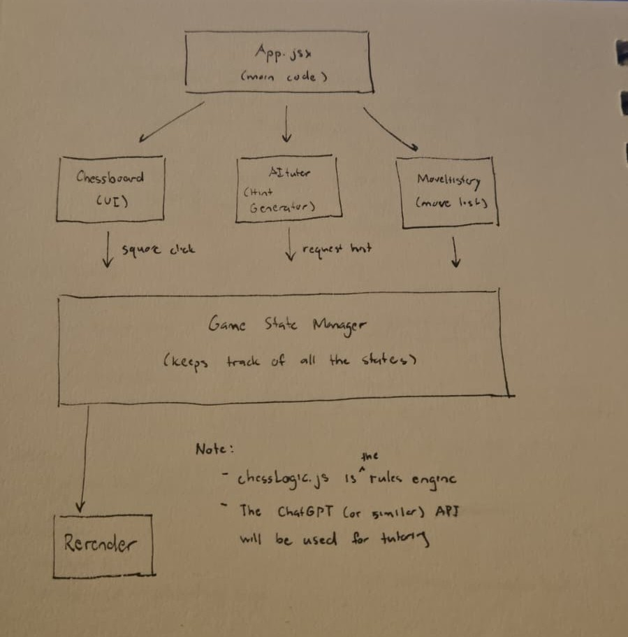

# High-Level Design Document

## Project Motivation
### Why are we doing this?
Most chess learning tools today rely on static lessons, videos, or puzzles. While these are helpful, they do not teach players *during* actual gameplay, when learning is most helpful. Our goal is to create an application that bridges this gap by embedding tutoring directly into a live chess match.

### Who will benefit?
This project aims to help:
- Beginners of all ages learning chess for the first time  
- Intermediate players wanting to improve strategy  
- Students participating in chess clubs or competitions  
- Anyone who learns best through interactive, real-time feedback  

Overall, the app is designed to be accessible and valuable to anyone interested in improving their chess skills.

---

## Team Responsibilities
### Initial Contributions
- **Chelsea:** Provided the base code for the chessboard component  
- **Ishmael:** Installed and configured TailwindCSS  

### Going Forward
- **Chelsea:** Implementing the tutoring system (move evaluation, hints, explanations)  
- **Ishmael:** Styling, layout, and UI/UX improvements  

### If Extra Time Allows
- **Ishmael:** Creating a mobile app version of the web app  

---

## External Data Sources and Services
We plan to use:
- **ChatGPT API (or similar)** for generating tutoring feedback, explanations, and dynamic hints.  
Additional APIs or libraries may be included as development progresses.

## Architecture Diagram Draft
