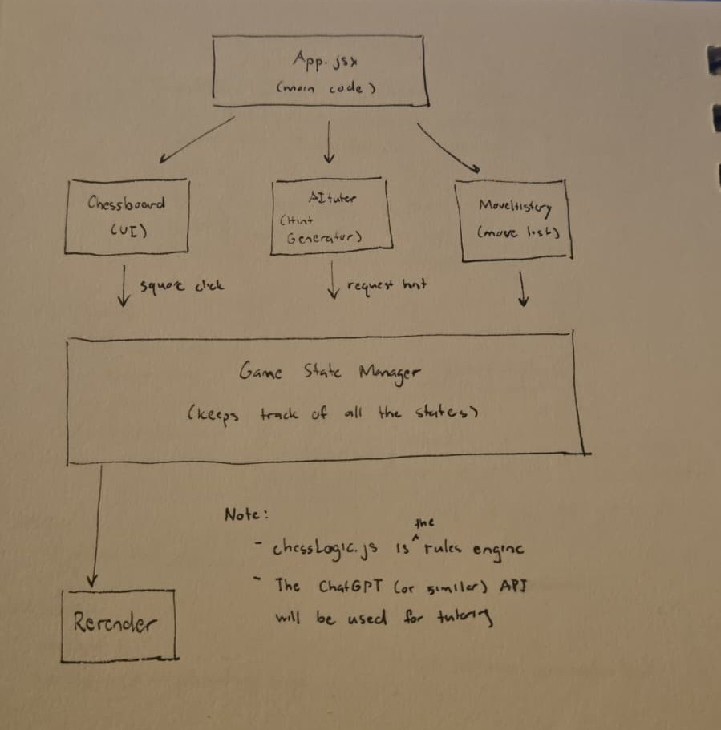

# High-Level Design Document

## Project Motivation
### Why are we doing this?
Most chess learning tools today rely on static lessons, videos, or puzzles. While these are helpful, they do not teach players *during* actual gameplay, when learning is most helpful. Our goal is to create an application that bridges this gap by embedding tutoring directly into a live chess match.

### Who will benefit?
This project aims to help:
- Beginners of all ages learning chess for the first time  
- Intermediate players wanting to improve strategy  
- Students participating in chess clubs or competitions  
- Anyone who learns best through interactive, real-time feedback  

Overall, the app is designed to be accessible and valuable to anyone interested in improving their chess skills.

---

## Team Responsibilities

### Contributions so far
- **Chelsea:** Added Chessboard, changed Tailwind CSS to regular CSS, added and improved AI tutor (GPT + stockfish)
- **Ishmael:** Installed and configured TailwindCSS, fixed the Stockfish error

### Going Forward
- **Chelsea & Ishamel:** We will work on having a dynamic AI opponent  
- We will also work on adding a working database in there

If we have time:
- **Ishmael:** Will work on a mobile app version of the web app  

---

## External Data Sources and Services
We plan to use:
- **StockFish** is the engine that analyses the chessboard and tactics
- **ChatGPT API** is used to turn the stockfish output into a more human readable output for the embedded tutor 

## Architecture Diagram Draft
